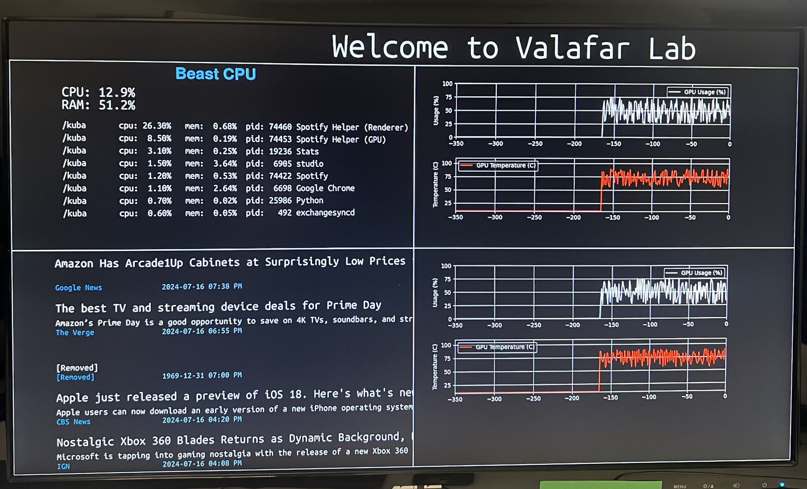
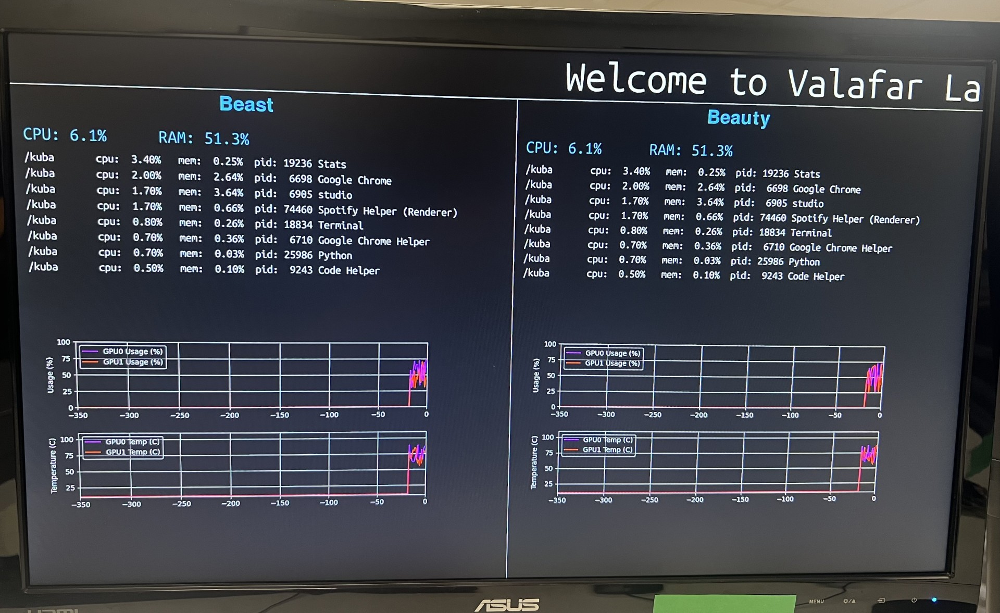

# InfoDisplay
Graphical Infomational Display


*the text moves across the screen from right to left*


There are 2 branches:

## Main branch looks like this:


## no-headlines-just-comp-info branch looks like this:



Here we will explain the main branch refer to the no-headlines-just-comp-info README.md for info on that branch.

This version displays 4 things. 

1. CPU and RAM usage data recived over a socket
2. GPU usage over time recived over a socket
3. GPU usage over time recived over a socket (diffrent computer of not)
4. Top 10 head lines from News API (shows 5 at a time)

Some things to note:

- If grpahs display a negative value that means there is an error

- If the CPU is -1 that mean the socket timed out and never recived anything if its -10 that means it recived somthing but there was an exeption

- When we send the CPU data it need to be in this format:

```python 
{"cpu_percent": 15.6, "ram_percent": 52.0, "top_processes": [{"memory_percent": 0.24704933166503906, "username": "kuba", "pid": 19236, "name": "Stats", "cpu_percent": 3.6}, ......]}
```
So: ```{"cpu_percent", "ram_percent", "top_processes"}```

- We can plot the data from one or more GPU's in the graph so they need to be sent as a list:

```python
    {"gpu_usage": [74, 57], "gpu_temp": [56, 60]}
```

So: ```{"gpu_usage", "gpu_temp"}``` but each as a list

- To receive data over the API you must regiser and use your own api key

- The placment of the object on the screen is supposed to be relative however hardcoded adjustments were made to make them fit the screen used in the lab so you have to adjust that for each screen

You can brodcast the data hoever you like but the **broadcaster.py** is an example of what I use 


